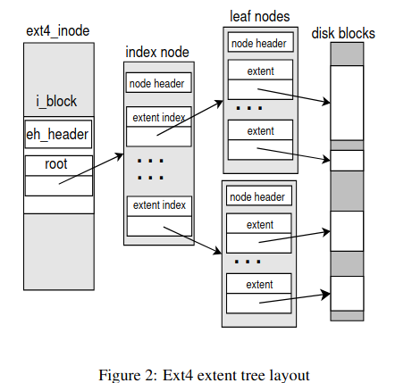
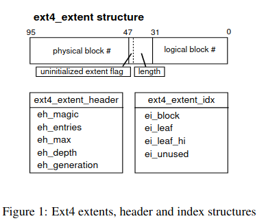

## Zadanie 1
```text
Zadanie 1. Wyjaśnij czym są punkty montażowe, a następnie wyświetl listę zamontowanych systemów
plików i wyjaśnij co znajduje się w poszczególnych kolumnach wydruku. 
Które z punktów montażowych dają dostęp do instancji pseudo systemów plików?  
Na podstawie mount(8) wyjaśnij znaczenie następujących atrybutów punktów montażowych: «relatime», «noexec» i «nodev»,  
a następnie podaj scenariusz, w którym ich zastosowanie jest pożądane
```

Punkt montażowy (mount points) wskazuje na katalog pod którym zamontowany jest jakiś dysk, może to być telefon, może być pendrive, dysk zewnetrzny itd.
Punkty montażowe możemy najprosciej wyświetlić czytajac `/proc/mounts`.

```text
[crusom@crusomcarbon ~]$ cat /proc/mounts
proc /proc proc rw,nosuid,nodev,noexec,relatime 0 0
sys /sys sysfs rw,nosuid,nodev,noexec,relatime 0 0
dev /dev devtmpfs rw,nosuid,relatime,size=8051452k,nr_inodes=2012863,mode=755,inode64 0 0
run /run tmpfs rw,nosuid,nodev,relatime,mode=755,inode64 0 0
efivarfs /sys/firmware/efi/efivars efivarfs rw,nosuid,nodev,noexec,relatime 0 0
/dev/mapper/MyVolGroup-root / ext4 rw,relatime 0 0
securityfs /sys/kernel/security securityfs rw,nosuid,nodev,noexec,relatime 0 0
tmpfs /dev/shm tmpfs rw,nosuid,nodev,inode64 0 0
devpts /dev/pts devpts rw,nosuid,noexec,relatime,gid=5,mode=620,ptmxmode=000 0 0
cgroup2 /sys/fs/cgroup cgroup2 rw,nosuid,nodev,noexec,relatime,nsdelegate,memory_recursiveprot 0 0
pstore /sys/fs/pstore pstore rw,nosuid,nodev,noexec,relatime 0 0
bpf /sys/fs/bpf bpf rw,nosuid,nodev,noexec,relatime,mode=700 0 0
systemd-1 /proc/sys/fs/binfmt_misc autofs rw,relatime,fd=39,pgrp=1,timeout=0,minproto=5,maxproto=5,direct,pipe_ino=6783 0 0
hugetlbfs /dev/hugepages hugetlbfs rw,nosuid,nodev,relatime,pagesize=2M 0 0
mqueue /dev/mqueue mqueue rw,nosuid,nodev,noexec,relatime 0 0
debugfs /sys/kernel/debug debugfs rw,nosuid,nodev,noexec,relatime 0 0
tracefs /sys/kernel/tracing tracefs rw,nosuid,nodev,noexec,relatime 0 0
tmpfs /run/credentials/systemd-journald.service tmpfs ro,nosuid,nodev,noexec,relatime,nosymfollow,size=1024k,nr_inodes=1024,mode=700,inode64,noswap 0 0
tmpfs /run/credentials/systemd-udev-load-credentials.service tmpfs ro,nosuid,nodev,noexec,relatime,nosymfollow,size=1024k,nr_inodes=1024,mode=700,inode64,noswap 0 0
fusectl /sys/fs/fuse/connections fusectl rw,nosuid,nodev,noexec,relatime 0 0
configfs /sys/kernel/config configfs rw,nosuid,nodev,noexec,relatime 0 0
tmpfs /run/credentials/systemd-tmpfiles-setup-dev-early.service tmpfs ro,nosuid,nodev,noexec,relatime,nosymfollow,size=1024k,nr_inodes=1024,mode=700,inode64,noswap 0 0
tmpfs /run/credentials/systemd-tmpfiles-setup-dev.service tmpfs ro,nosuid,nodev,noexec,relatime,nosymfollow,size=1024k,nr_inodes=1024,mode=700,inode64,noswap 0 0
tmpfs /run/credentials/systemd-sysctl.service tmpfs ro,nosuid,nodev,noexec,relatime,nosymfollow,size=1024k,nr_inodes=1024,mode=700,inode64,noswap 0 0
tmpfs /run/credentials/systemd-vconsole-setup.service tmpfs ro,nosuid,nodev,noexec,relatime,nosymfollow,size=1024k,nr_inodes=1024,mode=700,inode64,noswap 0 0
tmpfs /tmp tmpfs rw,nosuid,nodev,nr_inodes=1048576,inode64 0 0
/dev/nvme0n1p1 /boot vfat rw,relatime,fmask=0022,dmask=0022,codepage=437,iocharset=ascii,shortname=mixed,utf8,errors=remount-ro 0 0
tmpfs /run/credentials/systemd-tmpfiles-setup.service tmpfs ro,nosuid,nodev,noexec,relatime,nosymfollow,size=1024k,nr_inodes=1024,mode=700,inode64,noswap 0 0
binfmt_misc /proc/sys/fs/binfmt_misc binfmt_misc rw,nosuid,nodev,noexec,relatime 0 0
tmpfs /run/user/1000 tmpfs rw,nosuid,nodev,relatime,size=1613336k,nr_inodes=403334,mode=700,uid=1000,gid=1000,inode64 0 0
gvfsd-fuse /run/user/1000/gvfs fuse.gvfsd-fuse rw,nosuid,nodev,relatime,user_id=1000,group_id=1000 0 0
```

format zdefiniowany jest w `man fstab`

1. zamontowane urządzenie. W przypadku dysku /dev/mapper/MyVolGroup-root widzimy jego adres, w przypadku pseudosystemow plikow widzimy ich nazwe.
2. punkt montazowy
3. typ systemu likow
4. opcje montazowe, podstawowe opcje to np. ro lub rw
5. dummy value uzywane przez dump(8), domyslnie 0
6. dummy value uzywane przez fsck(8), domyslnie 0

### Które z punktów montażowych dają dostęp do instancji pseudo systemów plików?  
proc  (procfs)
sys (sysfs)
dev (devtmpfs)
run (tmpfs)
tmp (tmpfs)
configfs

w zasadzie chyba wszystko oprócz /dev/mapper/MyVolGroup-root i /dev/nvme0n1p1 to wirtualne (pseudo) systemy plików


### Na podstawie mount(8) wyjaśnij znaczenie następujących atrybutów punktów montażowych: «relatime», «noexec» i «nodev»,a następnie podaj scenariusz, w którym ich zastosowanie jest pożądane
relatime - modyfikuje pole "Access time", tylko wtedy gdy poprzedni access time był wcześniej niż obecny modify or change. W efekcie widzimy maks jeden access time który się wydarzył po modyfikacji pliku.  
noexec - nie zezwala na bezposrednie wykonanie binarek. Security thing. Jesli na pendrivie są tylko zdjecia, to nie ma po co zwiekszac wektoru ataki.  
nodev - nie interpretuje urzadzen blokowych ani znakowych w fs.  Nie chcemy zeby w naszym ogólnodostępnym fs można było tworzyć urządzenia znakowe albo mieć dostęp do hardware'u


## Zadanie 2
```text
Zadanie 2. Korzystając z pól superbloku (ang. superblock) podaj wzór na wyliczenie wartości: rozmiaru
bloku, liczby i-węzłów i bloków przechowywanych w grupie bloków (ang. block group), liczby wpisów tablicy
deskryptorów grup bloków (ang. block group descriptor table).  
Wymień składowe należące do grupy bloków oraz podaj ich rozmiar w blokach. Które grupy bloków przechowują kopie zapasową superbloku i tablicy
deskryptorów grup bloków
```
### rozmiaru bloku, liczby i-węzłów i bloków przechowywanych w grupie bloków (ang. block group), liczby wpisów tablicy deskryptorów grup bloków (ang. block group descriptor table).  
rozmiar bloku = `(s_inodes_count * s_inode_size) / s_blocks_count`  
liczba i-nodeów = `s_inodes_per_group`  
liczba bloków = `s_blocks_per_group`  
liczba wpisów tablicy deskryptorów grup bloków = `s_blocks_count / s_blocks_per_group (tyle wpisów ile grup)`  

###  Wymień składowe należące do grupy bloków oraz podaj ich rozmiar w blokach. Które grupy bloków przechowują kopie zapasową superbloku i tablicy deskryptorów grup bloków
do grupy bloków należy inode table (128 bajtów), inode bitmap (s_inodes_per_group / 8), block bitmap (s_blocks_per_group / 8)


### Które grupy bloków przechowują kopie zapasową superbloku i tablicy deskryptorów grup bloków
 The first version of ext2 (revision 0) stores a copy at the start of every block group, along with backups of the group descriptor block(s). Because this can consume a considerable amount of space for large filesystems, later revisions can optionally reduce the number of backup copies by only putting backups in specific groups (this is the sparse superblock feature). The groups chosen are 0, 1 and powers of 3, 5 and 7.


## Zadanie 3
```text
Zadanie 3. Podstawowymi operacjami na systemie plików są: wyzeruj lub zapal bit w bitmapie i-węzłów
albo bloków, wczytaj / zapisz i-węzeł albo blok pośredni (ang. indirect block) albo blok danych. Podaj listę
kroków niezbędnych do realizacji funkcji dopisującej n bloków na koniec pliku. Zakładamy, że poszczególne
kroki funkcji są zawsze wdrażane synchronicznie. Zadbaj o to by funkcje nie naruszyły spójności systemu
plików w przypadku awarii zasilania. Dopuszczamy powstawanie wycieków pamięci
```
1. szukamy n wolnych bloków w Block Bitmap naszej grupy, jak nie znajdziemy, to szukamy w Block Bitmapach innych grup.
2. oznaczamy bloki w bitmapie jako uzywane
3. idziemy do naszego inode'a w inode table (zakładam że wcześniej już znaleźliśmy odpowiedni inode uid przechodząc przez directory)
4. musimy dopisac numery bloków które znalezlismy, w odpowiednim blocku z i_block. Mysle ze wystarczy znalezc ostatni blok przez i_size / rozmiar_bloku. Jeśli trzeba stworzyć indirect block, to znowu musimy sie przejsc po wolnych blokach i zaalokowac nowy blok.
5. modyfikujemy metadane inode'a, na pewno i_size i pewnie tez i_atime i i_mtime

Ponieważ w ext2 nie ma journalingu, to moze byc tak ze oznaczymy bloki jako uzyte, a nie zdazymy wcale ich uzyc.
Wtedy bedzie musial sobie z tym poradzic fsck.


## Zadanie 4
```text
Zadanie 4. Przy pomocy wywołania systemowego rename(2) można przenieść atomowo plik do katalogu
znajdującego się w obrębie tego samego systemu plików. Czemu «rename» zakończy się błędem «EXDEV» kiedy
próbujemy przenieść plik do innego systemu plików? Powtórz polecenia z zadania 3 dla funkcji przenoszącej
plik między dwoma różnymi katalogami w obrębie tego samego systemu plików. Zakładamy, że w katalogu
docelowym jest wystarczająco dużo miejsca na dodanie wpisu. Pamiętaj, że wpis katalogu nie może przecinać
granicy między blokami!
```

Jakbyśmy chcieli przenieść plik do innego fs, to niemoglibysmy tego zrobic atomowo.  
Wymagaloby to stworzenia noewgo pliku od poczatku w nowym fs, a nie po prostu przepięcia inode'a do innego directory.


### Powtórz polecenia z zadania 3 dla funkcji przenoszącej plik między dwoma różnymi katalogami w obrębie tego samego systemu plików. 
Katalog moze byc realizowany jako linked lista albo tablica indeksowana.  
1. znajdujemy wolny albo alokujemy nowy directory entry. Jesli to jest linked lista, to ustawiamy odpowiedni rec_len w poprzednim wpisie  
2. ustawiamy wszystkie pola w nowym dir entry, inode powinien byc na 0  
3. uzywamy xchg zeby przeniesc inode'y miedzy source dir entry do target dir entry, w ten sposob nowy dostanie odpowiedni inode, a stary dostanie 0  


## Zadanie 5
```text
Zadanie 5. Przy pomocy wywołania systemowego unlink(2) można usunąć plik niebędący katalogiem.
Powtórz polecenia z zadania 3 dla funkcji usuwającej plik zwykły z katalogu. Kiedy możliwe jest odwrócenie
operacji usunięcia pliku tj. odkasowania (ang. undelete)? 
Zauważ, że usunięcie pliku nie odbiera procesom możliwości czytania jego zawartości, o ile go otworzyły przed wywołaniem unlink(2). Kiedy w takim razie plik zostanie faktycznie usunięty z dysku?
```

1. zmniejsz i_links_count o 1
2. ustaw inode number w dir entry na 0 (czy da sie kroki 1 i 2 zrobic atomowo?)
3. jesli i_link_count wynosi teraz 0, to ustaw odpowiednie bity z block bitmap i inode bitmap na 0

unlink usuwa wpis w katalogu, jesli po zmniejszeniu o 1 i_links_count wynosi on 0, to dopiero plik (czyli inode i datablocki) jest usuwany.  
Jeśli po usunięciu wpisu w katalogu dalej jest on gdzies referowany, to nic nie stoi na przeszkodzie by utworzyć taki sam wpis jaki byl.  

### Zauważ, że usunięcie pliku nie odbiera procesom możliwości czytania jego zawartości, o ile go otworzyły przed wywołaniem unlink(2). Kiedy w takim razie plik zostanie faktycznie usunięty z dysku?
Unlink zwróci EBUSY jesli plik jest uzywany przez jakis proces.  
Natomiast mozna usunac plik ktory jest otwarty ale nieuzywany w danym momencie przez proces (?)  
W takim razie plik zostanie faktycznie usuniety, jak wszystkie deskryptory wskazujace na niego zostana zwolnione a unlink pozwoli sie wykonac i nie bedzie juz wiecej linkow na ten inode.
Mozemy uzyc lsof zeby sprawdzic jakie procesy maja otwarty deskryptor do pliku

## Zadanie 6
```text
Zadanie 6. Wyjaśnij co robi system plików ext2 przy tworzeniu dowiązania twardego (ang. hard link) i symbolicznego (ang. symbolic link). 
Gdzie jest przechowywana zawartość dowiązania symbolicznego? 
Jak za pomocą dowiązania symbolicznego stworzyć w systemie plików pętlę? 
Kiedy jądro systemu operacyjnego ją wykryje i zwróci błąd «ELOOP»? Czemu pętli nie da się zrobić z użyciem dowiązania twardego?
```


### Wyjaśnij co robi system plików ext2 przy tworzeniu dowiązania twardego (ang. hard link) i symbolicznego (ang. symbolic link). 
Dowiązanie twarde to po prostu wskazywanie na inode'a w jakims direntry.  
Dowiązanie symboliczne to typ pliku(i_mode = EXT2_S_IFLNK), w którym znajduje się referencja do innego pliku w postaci absolutnej albo relatywnej sciezki.

### Gdzie jest przechowywana zawartość dowiązania symbolicznego? 
dla symlinków krótszych niż 60 bajtów sciezka zapisywana jest w i_block, w przeciwnym wypadku w datablockach.

### Jak za pomocą dowiązania symbolicznego stworzyć w systemie plików pętlę? 
jeden symlink wskazuje na drugi, a drugi na pierwszy

### Kiedy jądro systemu operacyjnego ją wykryje i zwróci błąd «ELOOP»? 
Jądro followuje symlinki i jeśli wykryje za duzo symlinkow w jednym lookupie, obecnie jest to 40. 
```text
Linux imposes a limit of at most 40 (MAXSYMLINKS) symlinks in any one path lookup
```


### Czemu pętli nie da się zrobić z użyciem dowiązania twardego?
Bo nie da się hardlinkować do katalogów

## Zadanie 7
```text
Zadanie 7. Czemu fragmentacja systemu plików jest szkodliwym zjawiskiem? Zreferuj artykuł The new ext4 filesystem: current status and future plans2.  
Opisz w jaki sposób odroczony przydział bloków (ang. delayed allocation) [§3.2] zapobiega powstawaniu fragmentacji.  
Wytłumacz jak zakresy (ang. extents) [§2.2] pomagają w ograniczaniu rozmiaru metadanych przechowujących adresy bloków należących do danego pliku.  
Czy po defragmentacji systemu plików ext4 liczba wolnych bloków może wzrosnąć? Jak mógłby wyglądać najprostszy algorytm defragmentacji [§3.3]
```

### Czemu fragmentacja systemu plików jest szkodliwym zjawiskiem? Zreferuj artykuł The new ext4 filesystem: current status and future plans2.  

```text
High fragmentation rates cause greater disk access time affecting overall throughput, 
and increased metadata overhead causing less efficient mapping.
```

Kiedys dawno dawno temu, czyli przed tym jak dyski ssdy staly sie smiesznie tanie (przed 2018/19) uzywano w wiekszosci dyskow hdd, ktore to dziala tak  
ze kręcą się talerze, a glowica czyta dane sekwencyjnie.  
Jeśli więc dane są ustawione po sobie, to można je przeczytać w jednym obrocie talerza.  
Jeśli zaś są porozrzucane w różnych miejsach, to głowica musi przejść przez wiele obrotów talerza, zanim je wszystkie wczyta. 


### Opisz w jaki sposób odroczony przydział bloków (ang. delayed allocation) [§3.2] zapobiega powstawaniu fragmentacji.  

Idea jest taka, ze alokujemy bloki, jak wykonujemy flush na zbuforowanych przez write() danych (czyli jak wykonamy sync albo kernel zdecyduje sie na flush dirty buffers).  
W ten sposób możemy wykonać tylko jeden request, co pozwala zmniejszyc fragmentacje i liczbe operacji procesora.

### Wytłumacz jak zakresy (ang. extents) [§2.2] pomagają w ograniczaniu rozmiaru metadanych przechowujących adresy bloków należących do danego pliku.  



Extendy pozwalają nam odnieść się do jakiegos większego ciągu danych, co zmniejsza nam ilość metadanych (tak to kazdy blok w tym ciagu musialby miec swoj wpis) i zmniejsza fragmentacje.  



Struktura wyglada tak, mamy wiec maks 2^15 blokow w jednym ciagu.   
W jednym inode'dzie mozemy zmiescic 4 extendy, jesli potrzebujemy ich wiecej uzywany jest constant depth extent tree.

### Czy po defragmentacji systemu plików ext4 liczba wolnych bloków może wzrosnąć? Jak mógłby wyglądać najprostszy algorytm defragmentacji [§3.3]
Wolnych bloków będzie tyle samo, ale dostaniemy więcej ciągłej wolnej pamięci, co pomoże w przyszłych alokacjach.  

algorytm e4defrag dziala tak, ze tworzy tymczasowy inode w ktorym alokuje extendy.  
Później kopiuje bloki z oryginalnego inode'a do naszych extendów.  
Na końcu migruje block pointery na te nowe.


## Zadanie 8
```text
Zadanie 8. Przy użyciu programu debugfs(8) dla wybranej instancji systemu plików ext4 (np. partycja
przechowująca główny system plików Twojej instalacji systemu Linux) pokaż:
• fragmentację systemu plików (freefrag) i informacje o grupach bloków (stats),
• zakresy bloków z których składa się wybrany duży plik (extents),
• że dowiązanie symboliczne może być przechowywane w i-węźle (idump),
• do jakiego pliku należy wybrany blok (blocks, icheck, ncheck),
• reprezentację liniową małego katalogu (bdump).
```

### • fragmentację systemu plików (freefrag) i informacje o grupach bloków (stats),
zwraca mi /dev/MyVolGroup/root: Block bitmap checksum does not match bitmap while reading block bitmap

Musiałbym odmontować dysk a średnio pendrive'a pod ręką, żeby się chrootnąć gdzieś indziej więc meh

### • zakresy bloków z których składa się wybrany duży plik (extents),

```text
debugfs:  extents /var/log/journal/df02ae7ac30c4102b7ed89eea57e002a/system.journal
Level Entries       Logical              Physical Length Flags
 0/ 1   1/  1     0 -  8191  18384786               8192
 1/ 1   1/150     0 -     0  47526463 -  47526463      1
 1/ 1   2/150     1 -   875  28927631 -  28928505    875
 1/ 1   3/150   876 -  1337  28919938 -  28920399    462
 1/ 1   4/150  1338 -  1340  28920400 -  28920402      3 Uninit
 1/ 1   5/150  1341 -  1489  28920403 -  28920551    149
 1/ 1   6/150  1490 -  1490  28920552 -  28920552      1 Uninit
 1/ 1   7/150  1491 -  1491  28920553 -  28920553      1
 ---------------------------- snip -------------------------------
  1/ 1 135/150  5872 -  5872  83973872 -  83973872      1 Uninit
 1/ 1 136/150  5873 -  5899  83973873 -  83973899     27
 1/ 1 137/150  5900 -  5915  83973900 -  83973915     16 Uninit
 1/ 1 138/150  5916 -  5961  83973916 -  83973961     46
 1/ 1 139/150  5962 -  5977  83973962 -  83973977     16 Uninit
 1/ 1 140/150  5978 -  5983  83973978 -  83973983      6
 1/ 1 141/150  5984 -  5984  83973984 -  83973984      1 Uninit
 1/ 1 142/150  5985 -  6014  83973985 -  83974014     30
 1/ 1 143/150  6015 -  6017  83974015 -  83974017      3 Uninit
 1/ 1 144/150  6018 -  6068  83974018 -  83974068     51
 1/ 1 145/150  6069 -  6085  83974069 -  83974085     17 Uninit
 1/ 1 146/150  6086 -  6086  83974086 -  83974086      1
 1/ 1 147/150  6087 -  6104  83974087 -  83974104     18 Uninit
 1/ 1 148/150  6105 -  6143  83974105 -  83974143     39
 1/ 1 149/150  6144 -  6253 102815744 - 102815853    110
 1/ 1 150/150  6254 -  8191 102815854 - 102817791   1938 Uninit
```

### • że dowiązanie symboliczne może być przechowywane w i-węźle (idump),

```text
debugfs:  idump /home/crusom/Desktop/studia/ii/so/cwiczenia/11/sym
0000  ffa1 e803 0300 0000 1f87 6167 1f87 6167  ..........ag..ag
0020  1f87 6167 0000 0000 e803 0100 0000 0000  ..ag............
0040  0000 0000 0100 0000 6865 7900 0400 0000  ........hey.....
0060  0000 0000 0000 0000 0000 0000 0000 0000  ................
*
0140  0000 0000 29be faf0 0000 0000 0000 0000  ....)...........
0160  0000 0000 0000 0000 0000 0000 cc80 0000  ................
0200  2000 1007 ac0e b81b ac0e b81b ac0e b81b   ...............
0220  1f87 6167 ac0e b81b 0000 0000 0000 0000  ..ag............
0240  0000 0000 0000 0000 0000 0000 0000 0000  ................
```
https://archive.kernel.org/oldwiki/ext4.wiki.kernel.org/index.php/Ext4_Disk_Layout.html

W ext4 i_block znajduje sie pod 0x28 i ma 60 bajtow, wiec sie zgadza, chociaz nie wiem czemu zoffsetowana jest ta sciezka ??


### • do jakiego pliku należy wybrany blok (blocks, icheck, ncheck),

blocks
```text
debugfs:  blocks /home/crusom/Desktop/studia/ii/so/cwiczenia/11/writeup.md
84091750 84091751 84091752 84091753 84091754
```
icheck
```text
debugfs:  icheck 84091750
Block   Inode number
84091750        13008216
```
co sie zgadza
```text
debugfs:  stat /home/crusom/Desktop/studia/ii/so/cwiczenia/11/writeup.md
Inode: 13008216
```

ncheck
```
debugfs:  ncheck 13008216
Inode   Pathname
13008216        /home/crusom/Desktop/studia/ii/so/cwiczenia/11/writeup.md
```

### • reprezentację liniową małego katalogu (bdump).
```text
stat /home/crusom/Desktop/studia/ii/so/cwiczenia/11/smol
----
Device: 254,2   Inode: 13008216
```

```text
debugfs:  bdump 13008216
0000  4015 9186 9186 1e80 808b 801b 3c3e 92a9  @...........<>..
0020  5b1f 8f8f 8c90 1b9b 8c93 9695 1a93 8692  [...............
0040  808e 1e54 9839 9b53 9508 8889 8c89 1b83  ...T.9.S........
0060  8787 8089 1f7c 3d4b 234a 4608 b98b b58c  .....|=K#JF.....
0100  ad1e 9691 9396 941e 9694 8f93 921a 9485  ................
0120  9282 931e 799a 65a8 7499 088d 8787 8c87  ....y.e.t.......
0140  1b86 8689 8888 1f7c 7d79 7680 7f08 8687  .......|}yv.....
0160  8787 841b 8206 649e 58a0 6399 088c 8687  ......d.X.c.....
0200  8d88 1b87 8989 8486 8c84 8e7f 1f90 788d  ..............x.
0220  21fb 104c 8a49 4d1a 8afb 3a84 fb0c 7025  !..L.IM...:...p%
0240  088a 888b 8889 1a85 8e89 8f8e 908d 8e8f  ................
----------------
7660  8889 1f84 847e 7e86 8508 8788 888b 871b  .....~~.........
7700  8306 8b5d 9d68 961e 8a8d 8a8c 898d 088c  ...].h..........
7720  8988 8d88 1b83 8d82 8d81 8d08 9190 8b91  ................
7740  1bac 8ca5 9097 9708 ca06 7a93 ad88 ab1b  ..........z.....
7760  8c87 8c84 8d80 0887 8c83 811a fc8c fb36  ...............6
```


## Zadanie 9
```text
Zadanie 9 (bonus). Na podstawie §3 artykułu A Directory Index for Ext23 opisz strukturę danych HTree
i operację wyszukiwania wpisu katalogu o zadanej nazwie. Następnie wyświetl reprezentację HTree dużego
katalogu, np. /var/lib/dpkg/info, używając polecenia htree programu debugfs(8)
```

Korzeniem drzewa jest pierwszy blok pliku katalogu.  
Liścmi są dir bloki
# TODO
