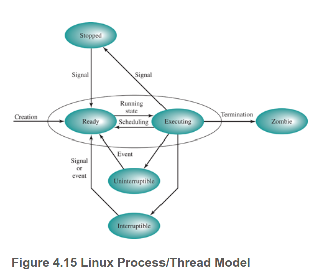

## Zadanie 1
```text
Na podstawie rysunku 4.15 z §4.6 przedstaw stany procesu w systemie Linux. 
Podaj akcje albo zdarzenia wyzwalające zmianę stanu. 
Które przejścia mogą być rezultatem działań podejmowanych przez: jądro systemu operacyjnego, kod sterowników, proces użytkownika?  
Wyjaśnij różnice między snem przerywalnym i nieprzerywalnym.  
Czy proces może zablokować lub zignorować sygnał «SIGKILL» lub «SIGSEGV»?
```
### Na podstawie rysunku 4.15 z §4.6 przedstaw stany procesu w systemie Linux. 


Stany:

- Running: This state value corresponds to two states. A Running process is either executing, or it is ready to execute.
- Interruptible: This is a blocked state, in which the process is waiting for an event, such as the end of an I/O operation, the availability of a resource, or a signal from another process.
- Uninterruptible: This is another blocked state. The difference between this and the Interruptible state is that in an Uninterruptible state, a process is waiting directly on hardware conditions and therefore will not handle any signals.
- Stopped: The process has been halted and can only resume by positive action from another process. For example, a process that is being debugged can be put into the Stopped state.
- Zombie: The process has been terminated but, for some reason, still must have its task structure in the process table.

### Podaj akcje albo zdarzenia wyzwalające zmianę stanu. 
Zmiana stanu może być podejmowana głównie przez sygnały albo eventy (wywołanie syscalli).  
Na przykład Executing -> Ready, gdy skończy się kwant czasu albo Executing -> Stopped, gdy debugger zatrzyma program (na przykład poprzez wrzucenie int3, tam gdzie chcemy breakpoint), int3 tworzy SIGTRAP

### Które przejścia mogą być rezultatem działań podejmowanych przez: jądro systemu operacyjnego, kod sterowników, proces użytkownika?  
Jądro:

- -> Ready (proces jest tworzony przez kernel)
- Ready <-> Executing (scheduler)
- Interruptible/Uninterruptible -> Ready (jądro oznajmia, że jakies IO sie zakonczylo)
- Zombie -> Terminated (użytkownik używa wait, a kernel grzebie proces)

Sterowniki (sterownik to właściwie moduł kernela):

- Interruptible/Uninterruptible -> Ready (jakies IO sie zakonczylo)
- Running -> Interruptible/Uninterruptible (wywołanie systemowe jakieś)

Użytkownik:

- Running -> Interruptable (wywołanie jakichś syscalli, które można przerwać)
- Running -> Stopped (debugging przez PTRACEME) albo wysłanie sygnału
- Stopped -> Running(debugging przez PTRACEME) albo wysłanie sygnału
- Running -> Zombie po exicie

### Wyjaśnij różnice między snem przerywalnym i nieprzerywalnym.  
Sen przerywany występuje gdy kernel wykonuje jakiś syscall, ale można go bezpiecznie przerwać.  
Sen nieprzerywany jest wtedy, gdy kernel wykonuje syscall, ale nie można go bezpiecznie przerwać. Proces w tym stanie jest nieśmiertelny  

<https://stackoverflow.com/questions/223644/what-is-an-uninterruptible-process>
```text
The classic example is read(). This is a system call that can take a long time (seconds) since it can potentially involve spinning up a hard drive, or moving heads. During most of this time, the process will be sleeping, blocking on the hardware.

While the process is sleeping in the system call, it can receive a Unix asynchronous signal (say, SIGTERM), then the following happens:

    The system call exits prematurely, and is set up to return -EINTR to user space.
    The signal handler is executed.
    If the process is still running, it gets the return value from the system call, and it can make the same call again.

Returning early from the system call enables the user space code to immediately alter its behavior in response to the signal. For example, terminating cleanly in reaction to SIGINT or SIGTERM.
```

<https://unix.stackexchange.com/questions/646826/cant-kill-wget-process-with-kill-9>
```text
A classical case of long uninterruptible sleep is processes accessing files over NFS when the server is not responding; modern implementations tend not to impose uninterruptible sleep (e.g. under Linux, since kernel 2.6.25, SIGKILL does interrupt processes blocked on an NFS access).
```

### Czy proces może zablokować lub zignorować sygnał «SIGKILL» lub «SIGSEGV»?
Na mocy słów cahira proces może zignorować SIGSEGV (ale nie powinien), ale nie może SIGKILL.  
Szara strefa jest trochę jak proces jest w Uninterruble stanie, ale wtedy tak czy tak gdy z niego wyjdzie, to zostanie zabity.

signal(7):
```text
The signals SIGKILL and SIGSTOP cannot be caught, blocked, or ignored.
```

## Zadanie 2
```text
Wyjaśnij różnice w tworzeniu procesów w systemie Linux (§10.3.3) i WinNT (§11.4.3).  
Naszkicuj przebieg najważniejszych akcji podejmowanych przez jądro w trakcie obsługi funkcji fork(2) i execve(2).  
Załóżmy, że system posiada wywołanie spawn, o takich samych argumentach jak execve.  
Zastępuje ono parę wywołań fork i execve, a realizuje takie samo zadanie.  
Dlaczego w takim przypadku mielibyśmy problemy z dodaniem do powłoki obsługi przekierowania standardowego wejścia/wyjścia odpowiednio z/do pliku albo łączenia dowolnych procesów potokami?
```

## Wyjaśnij różnice w tworzeniu procesów w systemie Linux (§10.3.3) i WinNT (§11.4.3).


### linux
Linux korzysta z syscalla fork(), żeby stworzyć nowy proces, a potem execve(), żeby zastąpić jego przestrzeń adresową.  

W linuxie proces jest reprezentowany przez process descriptor, który wskazuje na [task_struct](https://elixir.mayuworld.com/linux/latest/source/include/linux/sched.h#L748)  
Po wywołaniu forka tworzony jest nowy task_struct, który jest wypełniany w większości wartościami z task_structu parenta, za wyjątkiem oczywiście PID.  
Fork korzysta z clone, używając strace możemy zobaczyć jakie flagi stosuje 

```sh
clone(child_stack=NULL, flags=CLONE_CHILD_CLEARTID|CLONE_CHILD_SETTID|SIGCHLD, child_tidptr=0x7a3cf526fa10) = 183669
```
Widzimy jakieś flagi dotyczące thread id i SIGCHLD.

Task struct zawiera:

- Parametry planowania
- Pointery do segmentów
- Sygnały, maski
- Rejestry
- System call state
- File descriptor table
- Accounting (current cpu time)
- Stos kernela
- Inne, pid, ppid, user i inne takie


W szczególności dziecko dostaje swoją kopię file descriptorów.

Dziecko dostaje swój adres space, ale strony nie są kopiowane, lecz używany jest copy on write.

Wywoływany jest execve, tworzony jest nowy adres space a program jest mapowany do pamięci. Tworzony jest stos.  
Argv, argc i environ są kopiowane na stos, *sygnały są resetowane*, a rejestry zerowane, program jest wywoływany.


### windows
Windows korzysta w funkcji Win32.CreateProcess, która wywołuje NtCreateUserProcess. CreateProcess przyjmuje sporo argumentów.  
Win32.CreateProcess ->  kernel32.dll -> NtCreateUserProcess

1. Konwertuje z Win32 path name na NT path name, szuka binarki w PATH
2. NtCreateUserProcess działający w kernelu otwiera program i tworzy "section object", który się używa do mapowania programu do vaddress space'u
3. Process manager alokuje i inicjalizuje process object
4. Memory manager tworzy przestrzeń adresową procesu
5. Tworzona jest handle table, dziedziczone handle są kopiowane
6. Strona współdzielona jest mapowana do pamięci, memory manager inicjalizuje working-set który decyduje jakie strony swappować, gdy jest mało pamięci. 
Nasz program jest mapowany do przestrzeni adresowej według section object. 
7. Tworzony jest PEB (informacje takie jak pointery do sterty, lista załadowanych bibliotek)
8. Alokowana jest pamięć wirtualna, kopiowane są parametry procesu
9. Przyznwany jest unikalny PID, korzystając z ID table
10. Thread object jest alokowany i inicjalizowany. Stos uzytkownika jest zaalokowany razem z TEB. Context rekord zawierający początkowe wartości rejestrów dla wątku jest inicjalizowany.
11. Proces jest dodawany do globalnej listy procesów. Caller otrzymuje handle do procesu i thread objects.
12. NtCreateUserProcess powraca do trybu użytkownika z nowo utworzonym procesem, proces ma jeden wątek który jest suspenede.
13. Jeśli wywołanie się nie powiodło to coś tam coś tam
14. Rejestracja procesu w subsystemie csrss.exe. Subsystem wyświetla kursor w klepsydrą, potem już proces zwykle odpala swoje gui
15. Jeśli proces jest ograniczony, to ograniczenia są wprowadzane
16. Jeśli proces używa shims (ta libka do kompatybilnosci wstecznej), to są one stosowane
17. Wywoływany jest NtResumeThread i zwracana jest callerowi struktura z ID i handle'ami do procesu i wątku, które zostały utworzone

### Załóżmy, że system posiada wywołanie spawn, o takich samych argumentach jak execve. Zastępuje ono parę wywołań fork i execve, a realizuje takie samo zadanie. Dlaczego w takim przypadku mielibyśmy problemy z dodaniem do powłoki obsługi przekierowania standardowego wejścia/wyjścia odpowiednio z/do pliku albo łączenia dowolnych procesów potokami?
Wywołania fork i execve są dość ograniczone i przyjmują jedynie kilka argumentów. Działają imo według zasady KISS.  
Ponieważ po forku dziecko dostaje kopie file descriptors, a file description jest dzielony
```text
The child inherits copies of the parent's set of open file descriptors.  
Each file descriptor in the child refers to the same open file description (see open(2)) as the corresponding file descriptor in the parent.  
This means that the two file descriptors share open file status flags, file offset, and signal-driven I/O attributes  (see  the  description of F_SETOWN and F_SETSIG in fcntl(2)).
```
To gdyby od razu był wywoływany execve, to nowy program nadal miałby te same descriptory co rodzic.  
Gdy mamy najpierw forka, a potem execve, to dziecko ma czas na zmiane descriptorów, np. przekierowania standardowego wyjścia do pliku.  

Na Windowsie nie ma tego problemu, ponieważ CreateProcess przyjmuje strukture STARTUPINFO, której możemy podać handle na stdout/stderr/stdin.  
[Ten artykuł pokazuje jak można zrealizować przekierowania i potoki](https://learn.microsoft.com/en-us/windows/win32/procthread/creating-a-child-process-with-redirected-input-and-output).

Teoretycznie możnaby przed spawn() zmienić file descriptory, a po wywołaniu parent powróciłby do oryginalnych file descriptorów, ale najprawdopodobniej w wielowątkowym programie mogłoby to powodować race conditions.  
No i jest to zwyczajnie brzydki interfejs.  

APUE 8.3 dodaje, że przestrzeń między fork() a execve() daje nam też możliwość zmiany `user ID, signal disposition, and so on`

## Zadanie 3
```text
Zadanie 3. Na podstawie dokumentacji fork(2) (§8.3) i execve(2) (§8.10) wymień najważniejsze zasoby procesu, które są (a) dziedziczone przez proces potomny (b) przekazywane do nowego programu załadowanego do przestrzeni adresowej.  
Czemu przed wywołaniem fork należy opróżnić bufory biblioteki stdio(3)?  
Co jądro robi w trakcie wywołania execve z konfiguracją zainstalowanych procedur obsługi sygnałów?
```

### Na podstawie dokumentacji fork(2) (§8.3) i execve(2) (§8.10) wymień najważniejsze zasoby procesu, które są (a) dziedziczone przez proces potomny (b) przekazywane do nowego programu załadowanego do przestrzeni adresowej.  
a)

fork (2) ładnie opisuje co się różni między parentem a procesem potomnym:
```text
•  The child has its own unique process ID, and this PID does not match the ID of any existing process group (setpgid(2)) or session.
•  The child's parent process ID is the same as the parent's process ID.
•  The child does not inherit its parent's memory locks (mlock(2), mlockall(2)).
•  Process resource utilizations (getrusage(2)) and CPU time counters (times(2)) are reset to zero in the child.
•  The child's set of pending signals is initially empty (sigpending(2)).
•  The child does not inherit semaphore adjustments from its parent (semop(2)).
•  The child does not inherit process-associated record locks from its parent (fcntl(2)).  (On the other hand, it does inherit fcntl(2) open file description locks and flock(2)  locks
  from its parent.)
•  The child does not inherit timers from its parent (setitimer(2), alarm(2), timer_create(2)).
•  The  child  does  not inherit outstanding asynchronous I/O operations from its parent (aio_read(3), aio_write(3)), nor does it inherit any asynchronous I/O contexts from its parent
  (see io_setup(2)).
```
APUE ładnie opisuje co jest duplikowane:

```text
• Real user ID, real group ID, effective user ID, and effective group ID
• Supplementary group IDs
• Process group ID
• Session ID
• Controlling terminal
• The set-user-ID and set-group-ID flags
• Current working directory
• Root directory
• File mode creation mask
• Signal mask and dispositions
• The close-on-exec flag for any open file descriptors
• Environment
• Attached shared memory segments
• Memory mappings
• Resource limits
```

b)

man page znowu nam ładnie listuje co jest dziedziczone execve(2):
```text
       All process attributes are preserved during an execve(), except the following:

       •  The dispositions of any signals that are being caught are reset to the default (signal(7)).

       •  Any alternate signal stack is not preserved (sigaltstack(2)).

       •  Memory mappings are not preserved (mmap(2)).

       •  Attached System V shared memory segments are detached (shmat(2)).

       •  POSIX shared memory regions are unmapped (shm_open(3)).

       •  Open POSIX message queue descriptors are closed (mq_overview(7)).

       •  Any open POSIX named semaphores are closed (sem_overview(7)).

       •  POSIX timers are not preserved (timer_create(2)).

       •  Any open directory streams are closed (opendir(3)).

       •  Memory locks are not preserved (mlock(2), mlockall(2)).

       •  Exit handlers are not preserved (atexit(3), on_exit(3)).

       •  The floating-point environment is reset to the default (see fenv(3)).

       The process attributes in the preceding list are all specified in POSIX.1.  The following Linux-specific process attributes are also not preserved during an execve():

       •  The process's "dumpable" attribute is set to the value 1, unless a set-user-ID program, a set-group-ID program, or a program with capabilities is being executed, in which case  the
          dumpable  flag  may  instead  be  reset  to  the  value  in  /proc/sys/fs/suid_dumpable, in the circumstances described under PR_SET_DUMPABLE in prctl(2).  Note that changes to the
          "dumpable" attribute may cause ownership of files in the process's /proc/pid directory to change to root:root, as described in proc(5).

       •  The prctl(2) PR_SET_KEEPCAPS flag is cleared.

       •  (Since Linux 2.4.36 / 2.6.23) If a set-user-ID or set-group-ID program is being executed, then the parent death signal set by prctl(2) PR_SET_PDEATHSIG flag is cleared.

       •  The process name, as set by prctl(2) PR_SET_NAME (and displayed by ps -o comm), is reset to the name of the new executable file.

       •  The SECBIT_KEEP_CAPS securebits flag is cleared.  See capabilities(7).

       •  The termination signal is reset to SIGCHLD (see clone(2)).

       •  The file descriptor table is unshared, undoing the effect of the CLONE_FILES flag of clone(2).
```

Z ważniejszych rzeczy:
- handlery sygnałów są resetowane
- oczywiście memory mapping jest inny


### Czemu przed wywołaniem fork należy opróżnić bufory biblioteki stdio(3)?

<https://www.cs.uleth.ca/~holzmann/C/system/pipeforkexec.html>
```text
 For stdio functions, the child and parent have separate buffers (in their separate malloc arenas) and the input or output blocks will be mixed when the buffers are flushed. Obviously, stdio buffers should be flushed before a fork( ) which would be the parent's responsibility. Otherwise, both the child and the parent will have buffers with a copy of the unflushed data, which could result in duplicate copies on the I/O device
```
Generalnie dane który napłyneły do parenta a siedzą w bufferze najprawdopodobniej były skierowane własnie do niego.  
Stąd musimy zflushować dane, żeby proces potomny nie otrzymał czegoś czego nie powinien.  


### Co jądro robi w trakcie wywołania execve z konfiguracją zainstalowanych procedur obsługi sygnałów?
Resetuje 
```text
•  The dispositions of any signals that are being caught are reset to the default (signal(7)).
```

## Zadanie 4
```text
Zadanie 4. Uruchom program «xeyes» po czym użyj na nim polecenia «kill», «pkill» i «xkill».  
Który sygnał jest wysyłany domyślnie? Przy pomocy kombinacji klawiszy «CTRL+Z» wyślij «xeyes» sygnał «SIGTSTP», a następnie wznów jego wykonanie.  
Przeprowadź inspekcję pliku «/proc/pid/status» i wyświetl maskę sygnałów oczekujących na dostarczenie.  
Pokaż jak będzie się zmieniać, gdy będziemy wysyłać wstrzymanemu procesowi kolejno: «SIGUSR1», «SIGUSR2», «SIGHUP» i «SIGINT».  
Co opisują pozostałe pola pliku «status» dotyczące sygnałów?  
Który sygnał zostanie dostarczony jako pierwszy po wybudzeniu procesu?
```
### Który sygnał jest wysyłany domyślnie?
kill/pkill:
```sh
[crusom@crusomcarbon so21_lista_2]$ xeyes
Terminated
[crusom@crusomcarbon so21_lista_2]$ $?
bash: 143: command not found
```
Exit code to 128+n, gdzie n to numer sygnału, więc szybki lookup do man page'a i widzimy że
```text
       SIGTERM         15          15      15      15
```


xkill:
```sh
[crusom@crusomcarbon so21_lista_2]$ xeyes
X connection to :0 broken (explicit kill or server shutdown).
```

Spojrzałem na strace i widzę, że nie jest wysyłany sygnał do procesu, tylko xkill łączy się z "/tmp/.X11-unix/X0"
```sh
connect(3, {sa_family=AF_UNIX, sun_path=@"/tmp/.X11-unix/X0"}, 20) = 0
```
No i potem odbywa się komunikacja przez ten unix socket


SIGUSR1:
```sh
ShdPnd:       0000000000000200
```
czyli 1<<9

SIGUSR2:
```sh
ShdPnd: 0000000000000a00
```
czyli 1<<11

SIGHUP:
```sh
ShdPnd: 0000000000000a01
```
czyli 1<<0

SIGINT:
```sh
ShdPnd: 0000000000000a03
```
czyli 1<<1

### Który sygnał zostanie dostarczony jako pierwszy po wybudzeniu procesu?
```sh
[crusom@crusomcarbon so21_lista_2]$ fg
xeyes
Hangup
```
Jako pierwszy został dostarczony sygnał SIGHUP, który zapala ostatni bit maski (tzn. najmniej znaczący bit).  
Sygnały są przetwarzane po kolei właśnie idąc od najmniej ważnych bitów.  

### Co opisują pozostałe pola pliku «status» dotyczące sygnałów?

<https://access.redhat.com/solutions/3478631>
<https://www.man7.org/linux/man-pages/man7/signal.7.html>

SigQ:
```text
The first of these is the number of currently queued signals for this real user ID, and the second is the resource limit on the number of queued signals for this process (see the description of RLIMIT_SIGPENDING in getrlimit(2)).
```
- SigPnd - pending signals, sygnały które czekają na realizacje i są skierowane do wątku (być może czekają bo są chwilowo zablokowane)
- ShdPnd - jak wyżej, ale są skierowane do całego procesu
- SigBlk - blokowane sygnały, zwykle sygnały są blokowane czasowo
- SigCgt - łapane sygnały, czyli te które mają zdefiniowane handlery
- SigIgn - ignorowane sygnały, można ignorować wszystko za wyjątkiem SIGKILL i SIGSTOP

## Zadanie 5
```text
Zadanie 5. Na podstawie kodu źródłowy sinit.c1 opowiedz jakie zadania pełni minimalny program rozruchowy sinit.  
Jakie akcje wykonuje pod wpływem wysyłania do niego sygnałów wymienionych w tablicy «sigmap»?  
Do czego służą procedury sigprocmask(2) i sigwait(3)? W jaki sposób grzebie swoje dzieci?
```

Kod z komentarzami:
```c
/* See LICENSE file for copyright and license details. */
#include <sys/types.h>
#include <sys/wait.h>

#include <signal.h>
#include <stdio.h>
#include <stdlib.h>
#include <unistd.h>

#define LEN(x)	(sizeof (x) / sizeof *(x))
#define TIMEO	30

static void sigpoweroff(void);
static void sigreap(void);
static void sigreboot(void);
static void spawn(char *const []);

static struct {
	int sig;
	void (*handler)(void);
} sigmap[] = {
	{ SIGUSR1, sigpoweroff },
	{ SIGCHLD, sigreap     },
	{ SIGALRM, sigreap     },
	{ SIGINT,  sigreboot   },
};

#include "config.h"

static sigset_t set;

int
main(void)
{
	int sig;
	size_t i;

    // it should be init right
	if (getpid() != 1)
		return 1;
	chdir("/");
    // 'sigfillset' initializes a signal set to contain all signals.
	sigfillset(&set);
    // sigprocmask — examine and change blocked signals
    // SIG_BLOCK The set of blocked signals is the union of the current set and the set argument.
    // it blocks all signals, to then use sigwait, so that signals are handled synchronously.
	sigprocmask(SIG_BLOCK, &set, NULL);
	spawn(rcinitcmd);
	while (1) {
        // alarm() arranges for a SIGALRM signal to be delivered to the calling process in seconds seconds.
		alarm(TIMEO);
		// The  sigwait()  function  suspends  execution  of the calling thread until one of the signals specified in the signal set set becomes pending.
        // For a signal to become pending, it must first be blocked with sigprocmask(2).
        // The function accepts the signal (removes it from the pending list of signals), and returns the signal number in sig.
        sigwait(&set, &sig);
        // itaretes over possible signals and if it is defined, call the handler
		for (i = 0; i < LEN(sigmap); i++) {
			if (sigmap[i].sig == sig) {
				sigmap[i].handler();
				break;
			}
		}
	}
	/* not reachable */
	return 0;
}

// self-explaining
static void
sigpoweroff(void)
{
	spawn(rcpoweroffcmd);
}

// well, if we got an orphan who died then we need to reap him
static void
sigreap(void)
{
	while (waitpid(-1, NULL, WNOHANG) > 0)
		;
	alarm(TIMEO);
}
// self-explaining
static void
sigreboot(void)
{
	spawn(rcrebootcmd);
}

static void
spawn(char *const argv[])
{
	switch (fork()) {
	case 0:
        // "The signals in set are removed from the current set of blocked signals.  It is permissible to attempt to unblock a signal which is not blocked."
        // well, the program we are executing should not use the parents handlers.
		sigprocmask(SIG_UNBLOCK, &set, NULL);
        // "setsid()  creates  a  new session if the calling process is not a process group leader.
        // The calling process is the leader of the new session (i.e., its session ID is made the same as its process ID).
        // The calling process also becomes the process group leader of a new process group in the session (i.e., its process group ID is made the same as its process ID)."
		setsid();
        // run the program
        // remember that exec shouldn't return
		execvp(argv[0], argv);
		perror("execvp");
		_exit(1);
	case -1:
		perror("fork");
	}
}
```

### Na podstawie kodu źródłowy sinit.c1 opowiedz jakie zadania pełni minimalny program rozruchowy sinit. Jakie akcje wykonuje pod wpływem wysyłania do niego sygnałów wymienionych w tablicy «sigmap»?  

Program rozruchowy sprawdza czy ma pid 1, uruchamia init program, blokuje wszystkie sygnały i ustawia alarm na 30 sekund.  
Potem korzysta z sigwait i co 30 sekund próbuje grzebać dziecko, jeśli jakieś jest.
Jeśli dostanie SIGINT to robi reboot, jeśli dostanie SIGUSR1 to wyłącza komputer, a jeśli SIGCHLD to grzebie dziecko.

###  Do czego służą procedury sigprocmask(2) i sigwait(3)? W jaki sposób grzebie swoje dzieci?
Sigprocmask zmienia maske sygnałów, w tym przypadku korzysta z SIG_BLOCK, więc blokuje wszystkie sygnały.  
Sigwait czeka, aż nie nadejdzie jakiś sygnał.  
Dzieci są grzebane przez
```c
while (waitpid(-1, NULL, WNOHANG) > 0)
    ;
alarm(TIMEO);
```

```text
-1     meaning wait for any child process.
```

```text
WNOHANG
      return immediately if no child has exited.
```
```text
waitpid(): on success, returns the process ID of the child whose state has changed; if WNOHANG was specified and one or more child(ren) specified  by  pid  exist,  but  have  not  yet
       changed state, then 0 is returned.  On failure, -1 is returned
```

No czyli po prostu sprawdzamy czy jest jakis dzieciak ktory musi byc pogrzebany.


## Zadanie 6
```text
Zadanie 6. Uzupełnij program «reaper.c» prezentujący powstawanie sierot. Proces główny przyjmuje rolę
żniwiarza (ang. reaper ) przy użyciu prctl(2). Przy pomocy procedury «spawn» utwórz kolejno procesy
syna i wnuka. Następnie osieroć wnuka kończąc działanie syna. Uruchom podproces wywołujący polecenie
«ps», aby wskazać kto przygarnął sierotę – przykład poniżej (zwróć uwagę na numery grup procesów):
1 PID PPID PGRP STAT CMD
2 24886 24643 24886 S+ ./reaper (main)
3 24888 24886 24887 S ./reaper (grandchild)
4 24889 24886 24886 R+ /usr/bin/ps -o pid,ppid,pgrp,stat,cmd
Po udanym eksperymencie należy zabić wnuka sygnałem «SIGINT», a następnie po nim posprzątać drukując
jego kod wyjścia. Wysłanie «SIGINT» do procesu głównego jest zabronione! Zauważ, że proces główny nie
zna numeru pid wnuka. W rozwiązaniu należy wykorzystać setpgid(2), pause(2), waitpid(2) i kill(2).
UWAGA! Użycie funkcji sleep(3) lub podobnych do właściwego uszeregowania procesów jest zabronione!
```

```text
       A  subreaper  fulfills the role of init(1) for its descendant processes.  When a process becomes orphaned (i.e., its immediate parent terminates), then that process will be reparented
       to the nearest still living ancestor subreaper.  Subsequently, calls to getppid(2) in the orphaned process will now return the PID of the subreaper process, and when the orphan termi‐
       nates, it is the subreaper process that will receive a SIGCHLD signal and will be able to wait(2) on the process to discover its termination status.
```

kod źródłowy w reaper.c

## Zadanie 7
```text
Zadanie 7. Uzupełnij program «cycle.c», w którym procesy grają w piłkę przy pomocy sygnału «SIGUSR1».
Proces główny tworzy n dzieci. Każde z nich czeka na piłkę, a po jej odebraniu podaje ją do swojego
starszego brata. Zauważ, że najstarszy brat nie zna swojego najmłodszego rodzeństwa, ale zna je ojciec –
więc należy go wciągnąć do gry! Niech tata rozpocznie grę rzucając piłkę do najmłodszego dziecka. Kiedy
znudzi Ci się obserwowanie procesów grających w piłkę możesz nacisnąć «CTRL+C» co wyśle «SIGINT»
do całej rodziny. Możesz wprowadź do zabawy dodatkową piłkę wysyłając sygnał «SIGUSR1» poleceniem
«kill». Czy piłki ostatecznie skleją się w jedną? W rozwiązaniu należy wykorzystać sigprocmask(2),
sigsuspend(2) i kill(2).
UWAGA! Użycie funkcji sleep(3) lub podobnych do właściwego uszeregowania procesów jest zabronione!
```


## Zadanie 8

```text
Reentrancy is a programming concept where a function or subroutine can be interrupted and then resumed before it finishes executing. This means that the function can be called again before it completes its previous execution. Reentrant code is designed to be safe and predictable when multiple instances of the same function are called simultaneously or in quick succession. A computer program or subroutine is called reentrant if multiple invocations can safely run concurrently on multiple processors, or if on a single-processor system its execution can be interrupted and a new execution of it can be safely started (it can be "re-entered"). The interruption could be caused by an internal action such as a jump or call, or by an external action such as an interrupt or signal, unlike recursion, where new invocations can only be caused by internal call.
```


