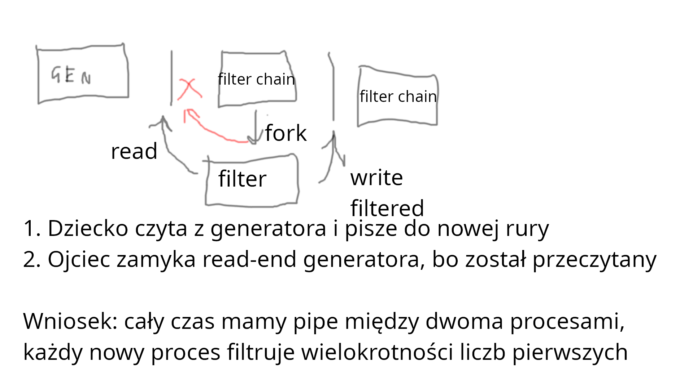

## Zadanie 1
```text
Zadanie 1. Rura pipe(7) to jednokierunkowe narzędzie do komunikacji międzyprocesowej.  
Co robi operacja read(2) i write(2), jeśli bufor rury jest odpowiednio pusty albo pełny?   
Jakie gwarancje daje nam operacja write na rurze, do której pisze wiele procesów – każdy z nich wiersze tekstu nie dłuższe niż «PIPE_BUF»?  
Weźmy potok utworzony poleceniem «ps -ef | grep sh | wc -l». 
Czemu wszystkie procesy należące do potoku zakończą się bez interwencji powłoki, jeśli co najmniej jeden z nich umrze?  
Kiedy operacje read i write na rurze zwracają „short count”?  
Jak można połączyć rodzica i dziecko rurą, która została utworzonapo uruchomieniu dziecka?
```

### Co robi operacja read(2) i write(2), jeśli bufor rury jest odpowiednio pusty albo pełny?   

pipe(7)
```text
       If a process attempts to read from an empty pipe, then read(2)
       will block until data is available.  If a process attempts to
       write to a full pipe (see below), then write(2) blocks until
       sufficient data has been read from the pipe to allow the write to
       complete.


       Nonblocking I/O is possible by using the fcntl(2) F_SETFL
       operation to enable the O_NONBLOCK open file status flag or by
       opening a fifo(7) with O_NONBLOCK.  If any process has the pipe
       open for writing, reads fail with EAGAIN; otherwise—with no
       potential writers—reads succeed and return empty.
```

### Jakie gwarancje daje nam operacja write na rurze, do której pisze wiele procesów – każdy z nich wiersze tekstu nie dłuższe niż «PIPE_BUF»?  

APUE p.537
```text
When we’re writing to a pipe (or FIFO), the constant PIPE_BUF specifies the
kernel’s pipe buffer size. A write of PIPE_BUF bytes or less will not be interleaved
with the writes from other processes to the same pipe (or FIFO). But if multiple
processes are writing to a pipe (or FIFO), and if we write more than PIPE_BUF bytes,
the data might be interleaved with the data from the other writers. We can determine
the value of PIPE_BUF by using pathconf or fpathconf (recall Figure 2.12).
```


### Weźmy potok utworzony poleceniem «ps -ef | grep sh | wc -l».  Czemu wszystkie procesy należące do potoku zakończą się bez interwencji powłoki, jeśli co najmniej jeden z nich umrze?  
tl;dr
Jeśli write-end rury został zamknięty, to read() zwróci EOF, co zakończy proces czytający.  
Jeśli read-end rury został zamknięty, to write() spowoduje wygenerowanie sygnału SIGPIPE.  
W ten sposób indukcyjnie zamkną się wszystkie procesy.

pipe(7)
```text
       If all file descriptors referring to the write end of a pipe have
       been closed, then an attempt to read(2) from the pipe will see
       end-of-file (read(2) will return 0).  If all file descriptors
       referring to the read end of a pipe have been closed, then a
       write(2) will cause a SIGPIPE signal to be generated for the
       calling process.  If the calling process is ignoring this signal,
       then write(2) fails with the error EPIPE.  An application that
       uses pipe(2) and fork(2) should use suitable close(2) calls to
       close unnecessary duplicate file descriptors; this ensures that
       end-of-file and SIGPIPE/EPIPE are delivered when appropriate.
```

### Kiedy operacje read i write na rurze zwracają „short count”?  
```text
O_NONBLOCK enabled, n <= PIPE_BUF
      If there is room to write n bytes to the pipe, then
      write(2) succeeds immediately, writing all n bytes;
      otherwise write(2) fails, with errno set to EAGAIN.


O_NONBLOCK enabled, n > PIPE_BUF
      If the pipe is full, then write(2) fails, with errno set
      to EAGAIN.  Otherwise, from 1 to n bytes may be written
      (i.e., a "partial write" may occur; the caller should
      check the return value from write(2) to see how many bytes
      were actually written), and these bytes may be interleaved
      with writes by other processes.
```
A tak to z grubsza po otrzymaniu EOF

###  Jak można połączyć rodzica i dziecko rurą, która została utworzona po uruchomieniu dziecka?
Można użyć named pipe (FIFO).  


## Zadanie 2
```text
Zadanie 2. Zapoznaj się z krytyką interfejsu plików przedstawioną w podrozdziale „ioctl and fcntl Are an Embarrassment”1.  
Do czego służy wywołanie systemowe ioctl(2)? Zauważ, że stosowane jest głównie do plików urządzeń znakowych lub blokowych.  
Na podstawie pliku ioccom.h2 wyjaśnij znaczenie drugiego i trzeciego parametru wywołania ioctl.  
Używając przeglądarki kodu3 jądra NetBSD znajdź definicje operacji «DIOCEJECT», «KIOCTYPE» i «SIOCGIFCONF», a następnie wytłumacz co one robią.
```

### Do czego służy wywołanie systemowe ioctl(2)? Zauważ, że stosowane jest głównie do plików urządzeń znakowych lub blokowych.  
No generalnie syscall stosowany do wielu miscellaneous rzeczy, APUE podaje:

| Category       | Prefix  | Header             | Constant Number |
|----------------|---------|--------------------|-----------------|
| Disk Labels    | DIOxxx  | `<sys/disklabel.h>`| 4               |
| File I/O       | FIOxxx  | `<sys/filio.h>`    | 14              |
| Magnetic Tape I/O | MTIOxxx | `<sys/mtio.h>` | 11              |
| Socket I/O     | SIOxxx  | `<sys/sockio.h>`   | 73              |
| Terminal I/O   | TIOxxx  | `<sys/ttycom.h>`   | 43              |


### Na podstawie pliku ioccom.h2 wyjaśnij znaczenie drugiego i trzeciego parametru wywołania ioctl.  
```c
int ioctl(int fildes, int request, ... /* arg */)
```

```c
SYSCALL_DEFINE3(ioctl, unsigned int, fd, unsigned int, cmd, unsigned long, arg)
```

```text
     37 /*
     38  * Ioctl's have the command encoded in the lower word, and the size of
     39  * any in or out parameters in the upper word.  The high 3 bits of the
     40  * upper word are used to encode the in/out status of the parameter.
     41  *
     42  *	 31 29 28                     16 15            8 7             0
     43  *	+---------------------------------------------------------------+
     44  *	| I/O | Parameter Length        | Command Group | Command       |
     45  *	+---------------------------------------------------------------+
     46  */
```

```text
 #define	_IOC(inout, group, num, len) \
     ((inout) | (((len) & IOCPARM_MASK) << IOCPARM_SHIFT) | \
     ((group) << IOCGROUP_SHIFT) | (num))
 #define	_IO(g,n)	_IOC(IOC_VOID,	(g), (n), 0)
 #define	_IOR(g,n,t)	_IOC(IOC_OUT,	(g), (n), sizeof(t))
 #define	_IOW(g,n,t)	_IOC(IOC_IN,	(g), (n), sizeof(t))
 /* this should be _IORW, but stdio got there first */
 #define	_IOWR(g,n,t)	_IOC(IOC_INOUT,	(g), (n), sizeof(t))
```

Trzeci parametr zależy od komendy, jest to czesto jakiś specyficzny struct pointer.


### Używając przeglądarki kodu3 jądra NetBSD znajdź definicje operacji «DIOCEJECT», «KIOCTYPE» i «SIOCGIFCONF», a następnie wytłumacz co one robią.

dkio.h 	67 #define DIOCEJECT	_IOW('d', 112, int) /* eject removable disk */

command for ejecting removable disk

110 #define KIOCTYPE	_IOR('k', 9, int) /* get keyboard type */
pobiera u_char	kbd_id; w struct kbd_state 

66 #define SIOCGIFCONF	_IOWR('i', 38, struct ifconf) /* get ifnet list */
wywołuje ifconf, które "Return interface configuration of system. "
```text
Records are added to the user buffer if they fit, and ifc_len is
adjusted to the length that was written.  Thus, the user is only
assured of getting the complete list if ifc_len on return is at
least sizeof(struct ifreq) less than it was on entry.
```

## Zadanie 3
```text
Zadanie 3. W systemach uniksowych katalog to ciąg bajtów reprezentujący listy rekordów dirent(3).
Na podstawie [3, rysunek 10-32] przedstaw reprezentację katalogu, a następnie wyjaśnij jak przebiegają operacje usuwania i dodawania pliku.  
W pierwszym przypadku rozważ scenariusz, w którym w reprezentacji katalogu za lub przed usuwanym wpisem istnieją nieużytki.  
W drugim, kiedy w pliku katalogu nie udaje się znaleźć wystarczająco dużo miejsca na przechowanie wpisu.  
Jądro leniwie wykonuje operację kompaktowania na katalogach – kiedy opłaca się ją zrobić?
```


### Na podstawie [3, rysunek 10-32] przedstaw reprezentację katalogu, a następnie wyjaśnij jak przebiegają operacje usuwania i dodawania pliku.  


dirent:
```c
ino_t           d_fileno;
uint16_t        d_reclen;
uint16_t        d_namlen;
uint8_t         d_type;
char            d_name[MAXNAMLEN + 1];
```
 
Usuwanie:
```text
All the removeal has done is increase the size of the total entry field
for colossal, turning the former field for voluminous into padding for the first entry.
This padding can be used for a subsequent entry, of course
```

###  W pierwszym przypadku rozważ scenariusz, w którym w reprezentacji katalogu za lub przed usuwanym wpisem istnieją nieużytki
Nieużytki zostają zkonsolidowane, tzn. d_reclen wpisu przed nieuzytkami jest zwiekszany

### W drugim, kiedy w pliku katalogu nie udaje się znaleźć wystarczająco dużo miejsca na przechowanie wpisu.  
Jest on dodawany na końcu

### Jądro leniwie wykonuje operację kompaktowania na katalogach – kiedy opłaca się ją zrobić?
Kiedy jest dużo nieużytków

## Zadanie 4
```text
Zadanie 4. Korzystając z poleceń «stat» i «ls -lia» zaprezentuj jak jądro systemu operacyjnego trawersuje ścieżkę bezwzględną «/usr/bin/cc».  
Od jakiego numeru i-węzła algorytm zaczyna działanie?  
Skąd sterownik uniksowego systemu plików wie gdzie na dysku znajduje się i-ty bajt pliku?  
Próba utworzenia dowiązania do pliku «/proc/version» kończy się błędem «EXDEV».  
Czemu nie możemy tworzyć dowiązań do plików znajdujących się w obrębie innych zamontowanych systemów plików?
```

### Od jakiego numeru i-węzła algorytm zaczyna działanie?  
/ ma numer 2

### Skąd sterownik uniksowego systemu plików wie gdzie na dysku znajduje się i-ty bajt pliku?  
Inode zawiera wskaźniki do bloków danych, są to wskaźniki bezpośrednie, single indirect pointer, double indirect pointer i tripe indirect pointer.  
No to żeby znaleźć numer bloku to będzie coś typu ity_bajt/wielkosc_bloku.  


### Próba utworzenia dowiązania do pliku «/proc/version» kończy się błędem «EXDEV». Czemu nie możemy tworzyć dowiązań do plików znajdujących się w obrębie innych zamontowanych systemów plików?

LPI p. 342
```text
Because directory entries (hard links) refer to files using just an i-node num-
ber, and i-node numbers are unique only within a file system, a hard link must
reside on the same file system as the file to which it refers.
```

## Zadanie 5
```text
Zadanie 5. Program «listdir» wypisuje zawartość katalogu w formacie przypominającym wyjście polecenia
«ls -l». Poniżej można znaleźć przykładowy wydruk, na którym widnieją odpowiednio: plik zwykły, dowiązanie
symboliczne, urządzenie znakowe, plik wykonywalny z bitem set-uid, jeden katalog z ustawionym bitem
set-gid i drugi z bitem sticky.
1 -rw-r--r-- 1 cahir cahir 2964 Fri Nov 15 14:36:59 2019 listdir.c
2 lrwxrwxrwx 1 cahir cahir 17 Mon Nov 4 11:14:49 2019 libcsapp -> ../csapp/libcsapp
3 crw--w---- 1 cahir tty 4, 2 Tue Nov 12 08:42:33 2019 tty2
4 -rwsr-xr-x 1 root root 63736 Fri Jul 27 10:07:37 2018 passwd
5 drwxrwsr-x 10 root staff 4096 Mon Jan 9 13:49:40 2017 local
6 drwxrwxrwt 23 root root 12288 Fri Nov 15 16:01:16 2019 tmp
Uzupełnij kod programu według wskazówek zawartych w komentarzach w kodzie źródłowym. Należy użyć:
• fstatat(2) do przeczytania metadanych pliku,
• major(3) i minor(3) do zdekodowania numeru urządzenia,
• readlinkat(2) to przeczytania ścieżki zawartej w dowiązaniu symbolicznym.
Implementacja iterowania zawartości katalogu będzie wymagała zapoznania się ze strukturą «linux_dirent»
opisaną w podręczniku getdents(2). Wywołanie systemowe «getdents» nie jest eksportowane przez
bibliotekę standardową, zatem należało je wywołać pośrednio – zobacz plik «libcsapp/Getdents.c».
```

## Zadanie 6
```text
Zadanie 6. (Pomysłodawcą zadania jest Tomasz Wierzbicki.)
Program «primes» używa Sita Eratostenesa4 do obliczania liczb pierwszych z przedziału od 2 do 10000.
Proces główny tworzy dwóch potomków wykonujących procedurę «generator» i «filter_chain», spiętych rurą «gen_pipe». 
Pierwszy podproces wpisuje do rury kolejne liczby z zadanego przedziału.  
Drugi podproces tworzy łańcuch procesów filtrów, z których każdy jest spięty rurą ze swoim poprzednikiem.  
Procesy w łańcuchu powstają w wyniku obliczania kolejnych liczb pierwszych.  
Każdy nowy filtr najpierw wczytuje liczbę pierwszą p od poprzednika, po czym drukuje ją, a następnie kopiuje kolejne liczby z poprzednika do następnika za wyjątkiem liczb podzielnych przez p.  
Program musi poprawnie działać dla argumentu 10000 – w tym przypadku powinno zostać utworzonych 1229 + 2 podprocesów.

Uwaga! Rozwiązania, które nie zapewniają pochówku umarłym dzieciom lub nie dbają o zamykanie nieużywanych końców rur, są uważane za błędne. Będziemy to sprawdzać poleceniem «ps» i «lsof»
```


