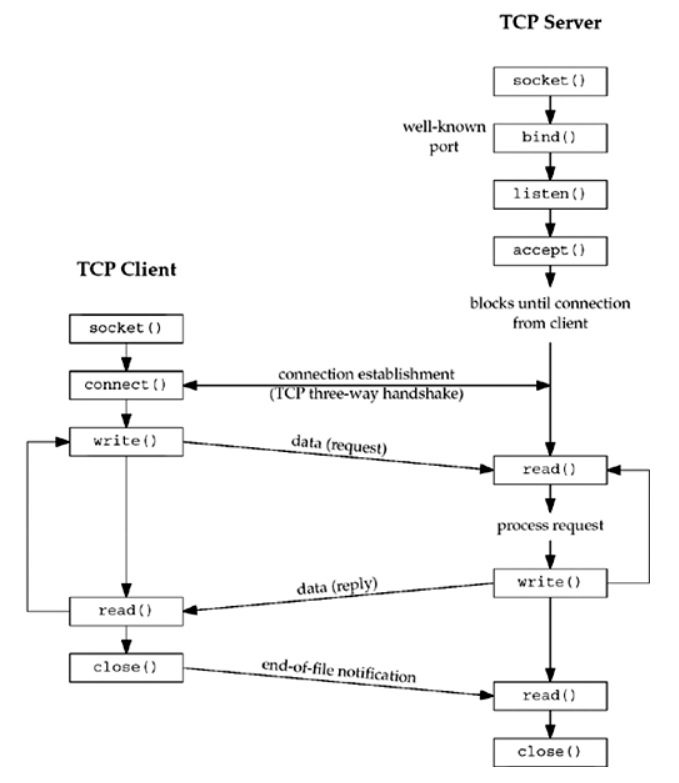
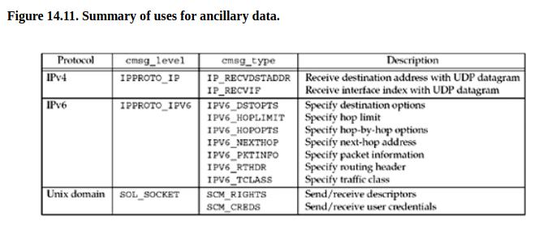
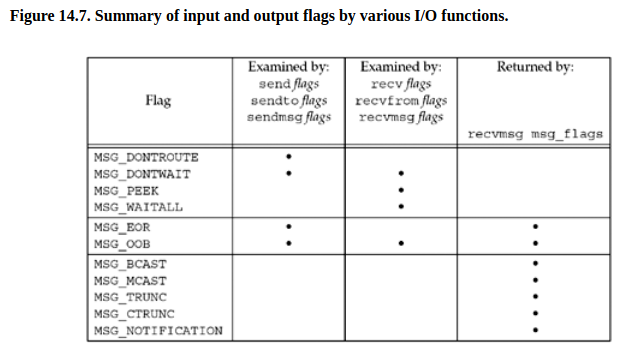

## Zadanie 1
```text
Zadanie 1. Na podstawie [ 6, 1.5] wyjaśnij zadania pełnione przez protokoły warstwy: łącza, sieciowej
i transportowej. Zainstaluj i uruchom program wireshark1. Przechwyć kilka pakietów protokołów UDP i TCP,
a następnie wytłumacz do czego służy kapsułkowanie (ang. encapsulation) i wyświetl (tj. kliknij dwukrotnie
na pakiet) nagłówki ramki, datagramu i segmentu. Zidentyfikuj adres źródłowy i docelowy pakietu. Czemu
protokoły warstwy łącza i sieciowej nie są używane do komunikacji między procesami użytkownika?
```

warstwa łącza - przesyła pakiet do kolejnego węzła  
warstwa sieciowa - zawiera adresy IP nadawcy i odbiorcy, zajmuje sie routingiem  
warstwa transportowa - określa protokół dostarczenia pakietu, na przykład TCP gwarantuje te SYN/ACK itd., a UDP nie 

## Zadanie 2
```text
Zadanie 2. Na podstawie [7, 2.3 i 2.4] omów różnice między protokołami warstwy transportowej: datagra-
mowym udp(7) i połączeniowym tcp(7). Czym różni się komunikacja półdupleksowa od dupleksowej?
Jak TCP radzi sobie z zagubieniem segmentu lub faktem, że segmenty mogą przyjść do odbiorcy w innej
kolejności niż zostały wysłane? Skąd protokół TCP wie kiedy połączenie zostało zerwane? Jaki problem
rozwiązuje sterowanie przepływem (ang. flow control) implementowane przez TCP?
```
UDP jest connection-less, tcp nie
tcp jest byte-stream, udp datagram has length
tcp ma flow control, mówi ile bajtów może przyjąć w danym czasie (advertised window), udp nie

full-duplex oba urzadzenia moga nadawac i odbierac jednoczesnie (np. rozmowa telefoniczna)
half-duplex albo jedna osoba nadaje i druga odbiera albo na odwrot

### Jak TCP radzi sobie z zagubieniem segmentu lub faktem, że segmenty mogą przyjść do odbiorcy w innej kolejności niż zostały wysłane?
No raz ze mamy te ACK/SYN itd., wiec mozna poprosic o retransmisje
dwa ze segmenty maja swoje numery

### Skąd protokół TCP wie kiedy połączenie zostało zerwane
albo moze sie zakonczyc przez FIN albo timeout zwykly

### Jaki problem rozwiązuje sterowanie przepływem (ang. flow control) implementowane przez TCP?
At any time, the window is the amount of room currently available in the receive
buffer, guaranteeing that the sender cannot overflow the receive buffe

## Zadanie 3
```text
Zadanie 3. Omów diagram [7, 4.1] komunikacji klient-serwer używającej protokołu tcp(7) przy pomocy
interfejsu gniazd strumieniowych. W którym momencie następuje związanie gniazda z adresem lokalnym
i zdalnym? Która ze stron komunikacji używa portów ulotnych (ang. ephemeral)? Co specyfikuje drugi
argument wywołania systemowego listen(2)? Z jakim numerem portu jest związane gniazdo przekazywane
do i zwracane z accept(2)? Skąd serwer wie, że klient zakończył połączenie?
```
```text
Clients, on the other hand, normally use ephemeral ports, that is, short-lived ports.
These port numbers are normally assigned automatically by the transport protocol to
the client. Clients normally do not care about the value of the ephemeral port; the
client just needs to be certain that the ephemeral port is unique on the client host. The
transport protocol code guarantees this uniquenes
```


### W którym momencie następuje związanie gniazda z adresem lokalnym i zdalnym?
przy connect

### która ze stron komunikacji używa portów ulotnych (ang. ephemeral)?
klient

### co specyfikuje drugi argument wywołania systemowego listen(2)?
```text
The  backlog argument defines the maximum length to which the queue of pending connections for sockfd may grow.  If a connection request arrives when the queue is full, the client may
       receive an error with an indication of ECONNREFUSED or, if the underlying protocol supports retransmission, the request may be ignored so that a later  reattempt  at  connection  suc‐
       ceeds
```
maskymalna liczba polaczen z jednego socketa

### z jakim numerem portu jest związane gniazdo przekazywane do i zwracane z accept(2)?
Jak serwer uzywa accept to przekazuje swoj deskryptor na ktorym nasluchuje, a dostaje deskryptor połączenia gdzie ma informacje o kliencie

### Skąd serwer wie, że klient zakończył połączenie?
klient robi close() i wysylany jest EOF


## Zadanie 4
```text
Zadanie 4. Omów diagram [ 7, 8.1] komunikacji klient-serwer używającej protokołu udp(7) przy pomocy
interfejsu gniazd datagramowych.  
Czemu, w przeciwieństwie do TCP, serwer może rozpocząć pracę zaraz po wykonaniu funkcji bind(2)?  
Z jakiej przyczyny interfejs read(2) i write(2) po stronie serwera może być niewystarczający?  
Przedstaw semantykę operacji recvfrom(2) i sendto(2). Kiedy po stronie klienta następuje związanie gniazda UDP z adresem lokalnym?  
Na podstawie [ 7, 8.11] zreferuj efekt jaki przynosi wykonanie connect(2) na gnieździe klienta.  
Jakie ograniczenia poprzednio wymienionych funkcji zostały poprawione przez wywołania recvmsg(2) i sendmsg(2)?
```


### Czemu, w przeciwieństwie do TCP, serwer może rozpocząć pracę zaraz po wykonaniu funkcji bind(2)?  
Bo UDP nie nawiązuje połączenia. Po prostu jak dostanie request to go przetwarza i daje odpowiedz.  

### Z jakiej przyczyny interfejs read(2) i write(2) po stronie serwera może być niewystarczający?  
No w przypadku TCP najpierw nawiazujemy polaczenie i dostajemy socket.
W przypadku UDP tak nie robimy, więc korzystamy z recvfrom zeby wypełnić socket z informacjami na temat nadawcy datagramu.  

Read i write jest niewystarczający, bo w odróżnieniu od TCP nie nawiazujemy polaczenia przez accept(), wiec nie mamy odpowiedniego socketa, z ktorego mozemy korzystac.

###  Przedstaw semantykę operacji recvfrom(2) i sendto(2). Kiedy po stronie klienta następuje związanie gniazda UDP z adresem lokalnym?  

```text
ssize_t recvfrom(int socket, void *restrict buffer, size_t length,
   int flags, struct sockaddr *restrict address,
   socklen_t *restrict address_len);
```

```text
ssize_t sendto(int socket, const void *message, size_t length,
   int flags, const struct sockaddr *dest_addr,
   socklen_t dest_len);
```

Związanie następuje przy sendto (?)

### Na podstawie [ 7, 8.11] zreferuj efekt jaki przynosi wykonanie connect(2) na gnieździe klienta.  
Dla UDP, jeśli zrobimy connect to będziemy akceptować datagramy od tylko jednego adresu IP  
korzystamy wtedy albo z read/write albo przy recvfrom/sendto w sockaddr dalemy NULL, poniewaz adres zostal zapisany w socketcie.

### Jakie ograniczenia poprzednio wymienionych funkcji zostały poprawione przez wywołania recvmsg(2) i sendmsg(2)?


Struktura generalnie wygląda tak:
```c
struct msghdr {
    void *msg_name; /* protocol address */
    socklen_t msg_namelen; /* size of protocol address */
    struct iovec *msg_iov; /* scatter/gather array */
    int msg_iovlen; /* # elements in msg_iov */
    void *msg_control; /* ancillary data (cmsghdr struct) */
    socklen_t msg_controllen; /* length of ancillary data */
    int msg_flags; /* flags returned by recvmsg() */
};
```

Możemy zauważyć scatter/gather array, czyli tak jak przy readv.
Np. duży blok danych może być zapisany w kilku mniejszych.


mozemy ustawic rozne control informatoin
np. 
```c
    MSG_WAITALL     = 0x100, /* Wait for a full request.  */
    // ...
    MSG_DONTWAIT    = 0x40, /* Nonblocking IO.  */
```


Więcej flag


### Zadanie 5
```text
Zadanie 5. Przyjrzyjmy się warunkom brzegowym, które występują w trakcie używania interfejsu gniazd BSD.
Kiedy read(2) i write(2) na gniazdach strumieniowych zwracają short counts?  
Skąd wiemy, że odebrany datagram UDP nie został obcięty przez jądro w trakcie kopiowania do przestrzeni użytkownika?  
Z jakich przyczyn należy być przygotowanym na to, że operacje na gniazdach zwrócą «EINTR»?  
Co się stanie, jeśli klient spróbuje zapisać do gniazda powiązanego z połączeniem, które serwer zdążył już zamknąć?  
Dlaczego w kodzie funkcji «open_listenfd» użyto wywołania setsockopt(2) z opcją «SO_REUSEADDR» [ 3, 61.10]?
Co by się stało gdyby programista o tym zapomniał?
```

### Kiedy read(2) i write(2) na gniazdach strumieniowych zwracają short counts?

Jeśli robimy write(), a w socket send buffer nie ma miejsca, to proces czeka az bedzie miejsce.  
Jeśli natomiast socket jest nonblocking a nie ma miejsca, to zwróci shortcount (tyle bajtów ile sie udalo skopiowac do bufora).

"Read operations on a blocking socket will always return a short count if some data is available,"

EINTR


### Skąd wiemy, że odebrany datagram UDP nie został obcięty przez jądro w trakcie kopiowania do przestrzeni użytkownika?  
Znamy długość datagramu

### Z jakich przyczyn należy być przygotowanym na to, że operacje na gniazdach zwrócą «EINTR»?  
```text
 read(2),  readv(2), write(2), writev(2), and ioctl(2) calls on "slow" devices.  
 A "slow" device is one where the I/O call may block for an indefinite time, for example, a terminal, pipe, or socket.  
 If an I/O call on a slow device has already transferred some data by the time it is interrupted by a signal handler, 
 then the call will return  a  success  status (normally, the number of bytes transferred).  
 Note that a (local) disk is not a slow device according to this definition; I/O operations on disk devices are not interrupted by signals.
```

```text
Socket  interfaces:  accept(2),  connect(2), recv(2), recvfrom(2), recvmmsg(2), recvmsg(2), send(2), sendto(2), and sendmsg(2), unless a timeout has been set on the socket (see below).
```

### Co się stanie, jeśli klient spróbuje zapisać do gniazda powiązanego z połączeniem, które serwer zdążył już zamknąć?  
dostaniemy EPIPE.

### Dlaczego w kodzie funkcji «open_listenfd» użyto wywołania setsockopt(2) z opcją «SO_REUSEADDR» [ 3, 61.10]? Co by się stało gdyby programista o tym zapomniał?
```text
A previous invocation of the server that was connected to a client performed
an active close, either by calling close(), or by crashing (e.g., it was killed by a signal).
This leaves a TCP endpoint that remains in the TIME_WAIT state until the
2MSL timeout expires
```
Z tego co rozumiem, to po zakończeniu połączenia nasz socket jest w stanie TIME_WAIT przez pewien czas, co ma obsługiwać jakieś edge case'y.  
Uniemożliwia to jednak szybki restart serwera.

## Zadanie 6
```text
Zadanie 6. Zmodyfikuj program «hostinfo.c» w taki sposób, aby wyświetlał adresy IPv4 oraz IPv6
dla danej nazwy serwera. Dodatkowo należy przekształcić nazwę usługi przekazanej jako opcjonalny trzeci
parametr programu na numer portu. Poniżej przykład:
# hostinfo www.google.com https
216.58.215.68:443
[2a00:1450:401b:803::2004]:443
Co należałoby zrobić, żeby program rozpoznawał usługę o nazwie «tftp»
```

## Zadanie 7

```sh
# najpierw serwer
tcp        0      0 127.0.0.1:48252         127.0.0.1:7777          TIME_WAIT   -

# pierwszy klient
tcp        0      0 127.0.0.1:7777          127.0.0.1:40550         ESTABLISHED 268598/./echoserver
tcp        0      0 127.0.0.1:40550         127.0.0.1:7777          ESTABLISHED 268688/./echoclient

# drugi klient
tcp        3      0 127.0.0.1:7777          127.0.0.1:40148         ESTABLISHED -
tcp        0      0 127.0.0.1:7777          127.0.0.1:40550         ESTABLISHED 268598/./echoserver
tcp        0      0 127.0.0.1:40550         127.0.0.1:7777          ESTABLISHED 268688/./echoclient
tcp        0      0 127.0.0.1:40148         127.0.0.1:7777          ESTABLISHED 268863/./echoclient
# w drugim procesie klienta nie dostajemy pinga
```

1-3 połączenie
4-7 hello world
8-10 zamkniecie klienta


## Zadanie 9
sam client
```text
[crusom@crusomcarbon so21_lista_9]$ ./echoserver 7777
Connected to localhost:48198
Rio_readlineb error: Connection reset by peer
```

sam serwer
```text
tcp        1      0 127.0.0.1:39374         127.0.0.1:7777          CLOSE_WAIT  289810/echoclient
tcp        0      0 127.0.0.1:7777          127.0.0.1:39374         FIN_WAIT2   -
```
mimo ze serwer zostal zamkniety to pozostaje w stanie FIN_WAIT2
